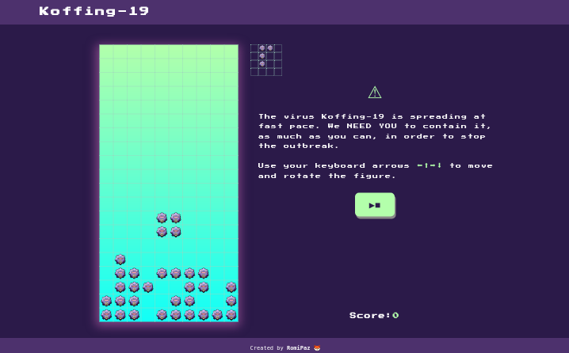
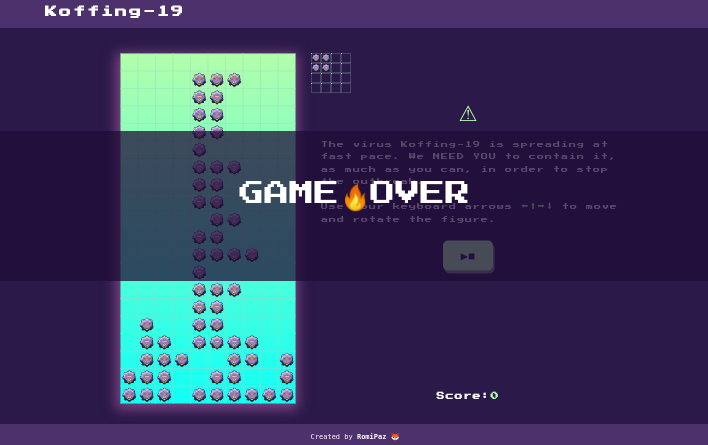

## Koffing-19 "A Mini Tetris Project"

This game is part of a personal exercise for practicing JS methods and getting a better understanding of arrays in a fun way. 
This project follows Ania Kubow's tutorial (You may follow her on Twitter @ania_kubow).

You can have a preview of how it looks like:

So far a version for Tablet and Mobile is not available.
For a better experience play it at fullsize window on your browser.

